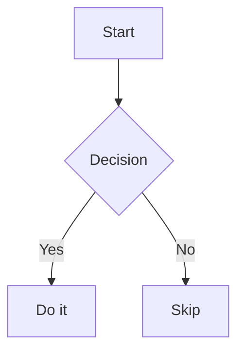

# Office File Preview Plus

Modern, high-performance read-only preview for Office documents, PDFs, diagrams, presentations, and markup files directly inside VS Code — enhanced with **Figma-like canvas gestures, smooth zooming, and responsive viewports**.

## ✨ Plus Features

- 🖐 **Hand Tool Pan**: Hold `Space` + Left-click drag, or use the **Middle Mouse Button** to pan around large sheets, zoomed PDFs, and diagrams smoothly.
- 🔍 **Smooth Canvas Zoom**: `Ctrl` / `Cmd` + Mouse Wheel to zoom freely between 30% and 350%, complete with a frosted-glass HUD badge.
- 🖱 **Double-Click Zoom**: Double-click anywhere in a Word, Excel, PowerPoint, or PDF preview to jump to 150%; double-click again to restore the previous zoom.
- 🗺 **Page Thumbnails Pane**: A Word-style navigation pane for PDF and Word previews — one small card per page stacked in a left sidebar, showing the real page content scaled down (PDF pages from their rendered canvases, Word pages rasterized from the live layout). Click a card to jump, the current page stays highlighted while you scroll, and the pane collapses to give the preview full width (open/closed is remembered).
- ⚡ **Quick Reset**: Press `Ctrl + 0` anytime to instantly restore 100% zoom.
- 📐 **Responsive PDF Viewport**: Automatically calculates optimal `fitScale` based on your editor split width and device pixel ratio.
- 🌐 **Clean Localization**: Modern English & bilingual-ready interface with zero hardcoded language quirks.

## Supported Formats

| Format | Extensions | Renderer |
|--------|-----------|----------|
| Word | `.docx` | [docx-preview](https://github.com/VolodymyrBaydalka/docxjs) — text, headings, tables, lists, styles |
| Excel | `.xlsx`, `.xlsm` | [SheetJS](https://sheetjs.com/) — all sheets with tab switcher |
| CSV / TSV | `.csv`, `.tsv` | Lightweight table preview with UTF-8 and Shift_JIS decoding |
| PDF | `.pdf` | [pdf.js](https://mozilla.github.io/pdf.js/) — responsive fit, high-resolution canvas |
| PowerPoint | `.pptx` | [pptx-preview](https://github.com/meshesha/pptx-preview) — slides in list view |
| Marp Slides | `.marp.md` | [Marp Core](https://github.com/marp-team/marp-core) — Slide presentation with navigation |
| Mermaid | `.mmd`, `.mermaid` | [Mermaid](https://mermaid.js.org/) — flowcharts, sequence diagrams, Gantt, etc. |
| HTML | `.html`, `.htm` | Static sandboxed iframe preview (the webview CSP disables page scripts) |
| Markdown | `.md`, `.markdown` | Rendered markdown with embedded Mermaid diagrams, relative images resolved from the file directory |

All previews are **read-only**. Files are never modified.

## Usage

Opening a `.docx`, `.xlsx`, `.pdf`, `.pptx`, `.mmd`, `.mermaid`, or `.marp.md` file automatically shows the preview.

For `.csv`, `.tsv`, `.html`, `.htm`, `.md`, and `.markdown` files (which have built-in VS Code editors), right-click the file → **Reopen Editor With…** → **Office File Preview (...)** to switch to the preview.

## Marp Slides Preview

Files with the `.marp.md` extension are automatically opened as slide presentations.

For regular `.md` files with `marp: true` in the frontmatter, right-click → **Reopen Editor With…** → **Office File Preview (Marp Slides)**.

Features:
- Slide-by-slide navigation (← → keys or buttons)
- Zoom controls from 25% to 300% (`+` / `-` or Ctrl/Cmd + mouse wheel)
- **Fit** mode to keep the whole slide visible (`0`)
- **Width** mode to fill the available width (`W`)
- Responsive scaling when the editor panel is resized
- Local relative images and CSS background images resolved from the Markdown file directory
- HTTPS images allowed by the webview content security policy
- All-slides overview mode
- Dark/light theme follows VS Code
- HTML rendering enabled

Note: the Marp preview manages zoom and keyboard navigation itself, so the global
canvas shortcuts (double-click zoom, `Ctrl+0`) are disabled there; middle-button
panning still works.

## Mermaid in Markdown

Mermaid code blocks inside `.md` files are automatically rendered as diagrams. The theme follows VS Code's dark/light mode.

````markdown

````

## Known Limitations

- pptx rendering faithfulness depends on slide complexity (animations and SmartArt may not render correctly)
- Large PDFs (200+ pages) render all pages at once; initial load may take a moment
- PDF pages are rendered to canvas at the initial fit resolution; zooming in beyond that gets blurry because the canvas is not re-rendered at the higher zoom
- HTML preview is static: the page's own JavaScript does not run (disabled by the content security policy and the iframe sandbox)
- Marp slides: custom themes (CSS files) are not yet supported; only built-in themes (default, gaia, uncover)
