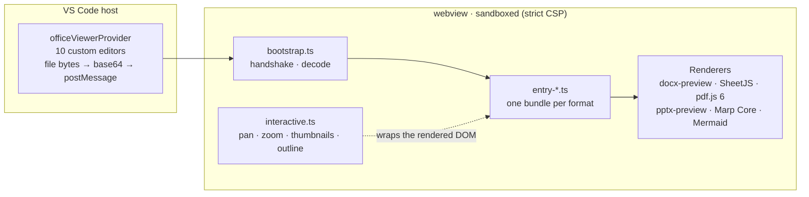

<div align="center">


# Office File Preview Plus

**Read-only preview for Word, Excel, PowerPoint, PDF, slides and diagrams — right inside VS Code,
with a Figma-like canvas: hand-tool pan, smooth anchored zoom, page thumbnails, outline & search.**

[](https://marketplace.visualstudio.com/items?itemName=Aafff623.vscode-office-viewer-plus)
[](https://marketplace.visualstudio.com/items?itemName=Aafff623.vscode-office-viewer-plus)
[](https://open-vsx.org/extension/Aafff623/vscode-office-viewer-plus)
[](https://github.com/Aafff623/vscode-office-viewer-plus/actions/workflows/release.yml)
[](https://github.com/Aafff623/vscode-office-viewer-plus/actions/workflows/release.yml)
[](LICENSE)

**[Install](#-install)** · [VS Code Marketplace](https://marketplace.visualstudio.com/items?itemName=Aafff623.vscode-office-viewer-plus) · [Open VSX](https://open-vsx.org/extension/Aafff623/vscode-office-viewer-plus) · [Releases (VSIX)](https://github.com/Aafff623/vscode-office-viewer-plus/releases) · [Changelog](CHANGELOG.md)

</div>

## 🤔 Why

VS Code has no idea what to do with an Office document: `.docx`, `.xlsx` and `.pptx` open as a *file is not displayed in the text editor* message, and PDF support requires a third-party extension. Viewers that do render these formats mostly stop at rendering — a static sheet you can only scroll.

**Office File Preview Plus** closes that gap with a deliberate two-layer design:

- **Rendering is delegated to proven engines** — pdf.js, SheetJS, docx-preview, pptx-preview, Marp Core, Mermaid — so documents look like documents.
- **The Plus layer contributes the canvas** — gestures, zoom, thumbnails, outline, search — everything generic renderers leave out.

Read-only by design. Files are never modified.

## 📸 See it in action

| Word — outline, search & thumbnails | Excel — sorting & frozen header |
|:---:|:---:|
|  |  |
| **PDF — page thumbnails pane** | **PowerPoint — slides on the canvas** |
|  |  |

## ✨ Highlights

### 🖐 Canvas interaction — every preview

- **Hand-tool pan** — hold `Space` + left-click drag, or use the **middle mouse button**, to move around large sheets, zoomed PDFs and diagrams.
- **Smooth canvas zoom** — `Ctrl`/`Cmd` + mouse wheel from **30% to 350%**, anchored at the middle of the pane: what you are looking at stays in place. A frosted-glass HUD badge shows the current zoom.
- **Double-click zoom** — double-click anywhere in a Word, Excel, PowerPoint or PDF preview to jump to 150% with the content under the pointer kept in place; double-click again to restore the exact view you came from (same zoom, same position, wherever the pointer is by then).
- **Quick reset** — `Ctrl + 0` instantly restores 100%.

### 📄 Word — navigation like a real reader

- **Automatic pagination** — chapters without explicit page breaks are split into real page-sized pages, matching the page box and repeating headers/footers.
- **Outline panel** — built from the document's real heading styles (works for any language); click to jump, current section stays highlighted while you scroll.
- **In-document search** — `Ctrl+F` with a match counter and `Enter` / `Shift+Enter` navigation; matches are highlighted without touching the document DOM.
- **Comments & tracked changes** — displayed as highlighted ranges with hover popovers.
- **Page thumbnails** — a Word-style navigation pane: one live card per page in a collapsible sidebar, rendered at your display's pixel density. Click to jump; open/closed state is remembered.

### 📊 Excel — built for large sheets

- **All sheets** with a tab switcher; sheets render lazily on activation so large workbooks don't freeze the preview.
- **Sorting** — click a column header to sort (numeric-aware, mixed text via natural collation); click again to reverse.
- **Frozen header row** — stays visible while you scroll.
- **Legacy `.xls`** (Excel 97–2003, BIFF8) opens in the same preview with tabs, sorting and the frozen header.
- **CSV / TSV** with UTF-8, UTF-16 and Shift_JIS decoding (a warning banner appears when a file falls back to Shift_JIS).

### 📑 PDF — sharp and responsive

- **Responsive viewport** — the initial scale adapts to your editor split width and device pixel ratio.
- **Scanned documents render** — WASM decoders for JBIG2/JPX images, plus CJK CMaps and standard font data, loaded on demand.
- **Page thumbnails pane** — cards downsampled from the already-rendered pages.

### 🎞 Slides & diagrams

- **PowerPoint** — slides flow continuously down the page and fit the available width; embedded EMF/WMF vector images are rasterized on the fly.
- **Marp slides** — `.marp.md` files open as presentations: slide navigation, 25–300% zoom, **Fit** / **Width** modes, all-slides overview, theme follows VS Code. Relative images resolve from the Markdown file's directory.
- **Mermaid** — `.mmd` / `.mermaid` files, and Mermaid code blocks inside any Markdown file, render as diagrams in the VS Code theme.
- **Markdown** — rendered with relative images resolved from the file directory; HTML is sanitized with DOMPurify.
- **HTML** — static sandboxed iframe preview (page scripts stay disabled by the webview CSP).

## 📂 Supported formats

| Format | Extensions | Renderer |
|--------|-----------|----------|
| Word | `.docx` | [docx-preview](https://github.com/VolodymyrBaydalka/docxjs) — text, headings, tables, lists, styles; outline, search, comments |
| Excel | `.xlsx` `.xlsm` `.xls` | [SheetJS](https://sheetjs.com/) — all sheets with tab switcher, sortable columns, frozen header |
| CSV / TSV | `.csv` `.tsv` | Lightweight table preview with UTF-8 / UTF-16 / Shift_JIS decoding |
| PDF | `.pdf` | [pdf.js](https://mozilla.github.io/pdf.js/) 6.2 — responsive fit, high-resolution canvas, WASM image decoders, CJK CMaps |
| PowerPoint | `.pptx` | [pptx-preview](https://github.com/meshesha/pptx-preview) — slides in list view; EMF/WMF rasterized on the fly |
| Marp slides | `.marp.md` | [Marp Core](https://github.com/marp-team/marp-core) — full slide presentation with navigation |
| Mermaid | `.mmd` `.mermaid` | [Mermaid](https://mermaid.js.org/) — flowcharts, sequence diagrams, Gantt, … |
| HTML | `.html` `.htm` | Static sandboxed iframe (CSP disables page scripts) |
| Markdown | `.md` `.markdown` | [marked](https://marked.js.org/) + DOMPurify — embedded Mermaid, relative images resolved |

All previews are **read-only**. Files are never modified.

## 📦 Install

**From the VS Code Marketplace** (recommended) — search for *"Office File Preview Plus"*, or run:

```bash
code --install-extension Aafff623.vscode-office-viewer-plus
```

Also available on [Open VSX](https://open-vsx.org/extension/Aafff623/vscode-office-viewer-plus) (VSCodium, Cursor, Windsurf, …) and as a `.vsix` from [GitHub Releases](https://github.com/Aafff623/vscode-office-viewer-plus/releases).

### Opening files

- **Opens automatically**: `.docx`, `.xlsx`, `.xlsm`, `.xls`, `.pdf`, `.pptx`, `.mmd`, `.mermaid`, `.marp.md`
- **Opt-in** — VS Code's built-in editor stays the default; right-click the file → **Reopen Editor With…** → *Office File Preview*: `.csv`, `.tsv`, `.html`, `.htm`, `.md`, `.markdown`
- A regular `.md` with `marp: true` in the frontmatter: **Reopen Editor With…** → *Office File Preview (Marp Slides)*

The extension never takes over your built-in editors: binary formats get the custom editor by default, text formats stay opt-in.

## ⌨️ Keyboard shortcuts

| Action | Keys | Where |
|--------|------|-------|
| Pan | hold <kbd>Space</kbd> + drag · middle mouse button | all previews |
| Smooth zoom (30%–350%) | <kbd>Ctrl</kbd>/<kbd>Cmd</kbd> + mouse wheel | all previews |
| Reset zoom to 100% | <kbd>Ctrl</kbd>+<kbd>0</kbd> | all previews |
| Zoom to 150% ⇄ restore view | double-click | Word · Excel · PowerPoint · PDF |
| Search in document | <kbd>Ctrl</kbd>+<kbd>F</kbd> · <kbd>Enter</kbd> / <kbd>Shift</kbd>+<kbd>Enter</kbd> | Word |
| Previous / next slide | <kbd>←</kbd> / <kbd>→</kbd> | Marp |
| Fit slide / fill width | <kbd>0</kbd> / <kbd>W</kbd> | Marp |

The Marp preview manages zoom and keyboard navigation itself, so the global canvas shortcuts (double-click zoom, `Ctrl+0`) are disabled there; middle-button panning still works.

## ⚙️ How it works



A few engineering decisions worth knowing:

- **One webview bundle per format** (`dist/webview-*.js`) — opening a CSV never loads Marp Core, opening a PDF never loads SheetJS.
- **Strict sandbox** — webview CSP `default-src 'none'` with nonces; Markdown output is sanitized with DOMPurify; the HTML preview is static.
- **Lazy rendering** — Excel sheets render on tab activation; Word thumbnails rasterize per page on scroll, with retries on failure.
- **Cache-safe assets** — bundled scripts and styles carry per-build content hashes, so upgrading the extension can never serve a stale webview build.
- **Self-verifying zoom anchoring** — a probe measures where the anchor actually landed and corrects the residue, normalized against VS Code's non-standard CSS-zoom coordinate behavior ([ADR-0002](docs/adr/ADR-0002-zoom-anchoring.md)).
- **CI-gated releases** — typecheck and 99 tests run before every package; published to the VS Code Marketplace, Open VSX and GitHub Releases.

Rendering-stack decisions are documented in [ADR-0001](docs/adr/ADR-0001-rendering-stack-and-thumbnails.md) and [ADR-0002](docs/adr/ADR-0002-zoom-anchoring.md).

## ⚠️ Known limitations

- pptx rendering faithfulness depends on slide complexity (animations and SmartArt may not render correctly)
- Large PDFs (200+ pages) render all pages at once; initial load may take a moment
- PDF pages are rendered to canvas at the initial fit resolution; zooming in beyond that gets blurry because the canvas is not re-rendered at the higher zoom
- Legacy `.xls` support targets the common BIFF8 format (Excel 97-2003); very old BIFF5 files open but non-Latin text may not decode correctly
- HTML preview is static: the page's own JavaScript does not run (disabled by the content security policy and the iframe sandbox)
- Marp slides: custom themes (CSS files) are not yet supported; only built-in themes (default, gaia, uncover)

## 🙏 Acknowledgments

This extension is an enhancement line over [vscode-office-viewer](https://github.com/takashi-uchida/vscode-office-viewer) by [takashi-uchida](https://github.com/takashi-uchida) (MIT) — the canvas gestures, thumbnails, navigation and localization layers are Plus additions.

Standing on the shoulders of: [docx-preview](https://github.com/VolodymyrBaydalka/docxjs) · [SheetJS](https://sheetjs.com/) · [pdf.js](https://mozilla.github.io/pdf.js/) · [pptx-preview](https://github.com/meshesha/pptx-preview) · [Marp Core](https://github.com/marp-team/marp-core) · [Mermaid](https://mermaid.js.org/) · [marked](https://marked.js.org/) · [DOMPurify](https://github.com/cure53/DOMPurify) · [html2canvas-pro](https://github.com/yorickshan/html2canvas-pro) · [emf-converter](https://github.com/papnkukn/emf-converter)

<div align="center">

<sub><b>Office File Preview Plus</b> — MIT © <a href="https://github.com/Aafff623">Aafff623</a><br>
If it saves you a round-trip to Word or Excel, a ⭐ on the repo helps others find it.</sub>

</div>
